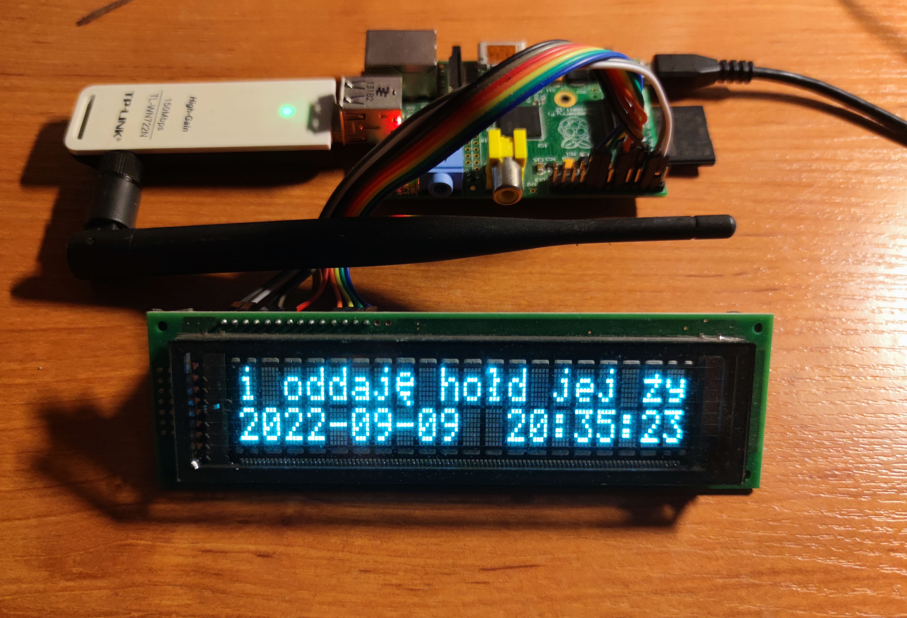

# Raspberry Pi 1 HD44780 news ticker



<figcaption><i>Photo of the complete project</i></figcaption>

## Description

### Background
The project started when an innocent thought popped into my mind... _Is it possible to control 
Raspberry Pi GPIO pins from program written in C, but without any third-party library?_ 
Sure, I knew it must be possible, but I couldn't help checking it in practice. Quick rummage
through my still unpacked after-moving boxes to find my old Raspberry Pi 1, two long evenings
with [BCM2835 Peripherals datasheet](https://www.raspberrypi.org/app/uploads/2012/02/BCM2835-ARM-Peripherals.pdf),
full of OS crashes and freezes caused by accidental writing to the wrong registers...and
I ended up with fully working proof-of-concept of the GPIO driver!

As it took me much less time than I thought I'd need, and I was in a mood for unrestrained by
pragmatism, joyful C development (yes, I find coding in C joyful; that explains quite a bit,
huh...? :sweat_smile: ), I decided to challenge myself and port one of my
previous projects, [rpi_vfd_ticker](https://github.com/Lefucjusz/rpi-vfd-ticker).
Original project was written in NodeJS; I was curious how much harder it would be to 
implement the same functionalities in C. **Spoiler: it is a lot harder** :stuck_out_tongue: 
Especially when it comes to parsing XMLs and memory management,`ASan` saved my life quite 
a few times...

### Functionalities
The main functionality of the program is simple - it presents news on a HD44780-compatible display in
a form of scrolling bar, like on TV - hence the name: TV news ticker. Data are fetched from RSS 
feed (technically it's just an XML) of TVN24 - Polish 24-hour commercial news channel - and
parsed to format possible to display as a moving text. After all news obtained last time have been
shown, new ones are fetched and presented, and so on...

Additionally, current date and time are shown on the bottom line of the display.

## Hardware

### Connections
| Display signal | Raspberry Pi pin |
|----------------|------------------|
 | VCC/+5V        | 4                |
 | VSS/GND        | 6                |
 | RS             | 7                |
| E              | 11               |
 | D4             | 12               |
 | D5             | 15               |
 | D6             | 16               |
 | D7             | 18               |

_Note 1: pin numbers refer to physical goldpins, not to SoC GPIO numbers_

_Note 2: connections mapping can be changed in HD44780 library config_ 

### Raspberry Pi
The project uses Raspberry Pi 1 model B. I used such an old device just because it had been
lying in my drawer for a while already, as it's hard to find any reasonable application 
for it. Its computing power is fairly limited as for today's standards...

### Display
The display can be any HD44780-compatible alphanumeric device. The program is designed for
20x2 version (20 columns, 2 rows), but after a few changes in code displays with different 
configurations can be used too.

The exact model of my device is Futaba M202MD15FA, widely used in cash registers manufactured by
Polish POSNET.  It's a [VFD display](https://en.wikipedia.org/wiki/Vacuum_fluorescent_display) - 
I love the color of the light emitted by displays manufactured with this technology :heart:

## How to run the project

### Clone the repo
```shell
git clone https://github.com/Lefucjusz/RPi-HD44780-news-ticker.git
```

or using `ssh`:

```shell
git clone git@github.com:Lefucjusz/RPi-HD44780-news-ticker.git
```

### Install the required libs
```shell
sudo apt install libcurl4-openssl-dev
```

### Build the project
```shell
cd RPi-HD44780-news-ticker
make
```

### Run the binary
```shell
cd bin
sudo ./main
```
**Warning! Running with `sudo` will execute this binary with `root` privileges.** This is however required
so that the program can access GPIO ports.

## FAQ

#### The program terminates with `Failed to initialize GPIO! Permission denied` message

Check whether you run the program with `root` privileges. Running it as a normal user will result in 
such message, as GPIO ports will be inaccessible.

## Things to improve

#### Error handling in XML parser

Current implementation of the XML parser is very straightforward and written specifically for the TVN24 news
XML, based on detecting certain symbols and substrings, with hardcoded offsets. There's almost no error 
handling - no validation of input data, no checking if newly parsed tag content has been added to buffer
successfully, just nothing. If one day TVN24 decides to change the format even slightly or the received
data will be corrupted, anything could happen - from incorrect result of parsing to complete crash of the 
program...

#### Diacritic characters substitution

This was supposed to be a quick makeshift solution, but since it worked surprisingly well - I left it 
as it was. The algorithm substituting Polish diacritics for HD44780 CGRAM addresses has been obtained 
by reverse-engineering the format. ASCII codes of the characters were just printed to console and
then hardcoded in a giant nested `switch...case`. There has to be a neater solution for this problem,
but for now...

#### Support for reading GPIO pins state

I just forgot to implement GPIO reading function at the stage of creating driver PoC...
Then, when the idea for this project emerged, I realized it won't be needed anyway, as 
the GPIO will only be used to control HD44780 display, so all the pins will be functioning as 
outputs. But there's a very good chance I'll need this functionality sooner than later, so 
maybe one day I'll implement it and remove this entry. The implementation will be rather
straightforward, one evening with aforementioned datasheet and it's done :smile: